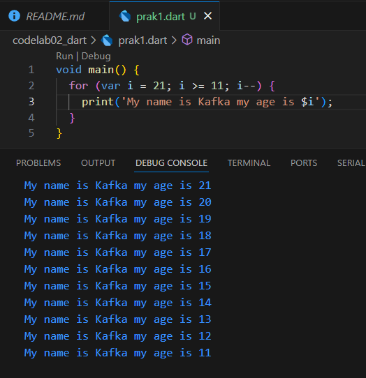

# Practical Assignment

### 1. Modify the code in line 3 in VS Code or your favorite code editor below to get the requested output! 1

### 2. Why is it so important to understand the Dart programming language before we use the Flutter framework? Explain!
Since Dart is the programming language behind Flutter, it serves as the foundation for everything Flutter does. While Flutter supplies the framework, widgets, and tools to build user interfaces and manage application state, Dart is what drives the logic and execution underneath. Gaining a solid understanding of Dart first provides the necessary background to grasp how Flutter functions, making it easier to use the framework effectively and write more reliable, efficient applications.

### 3. Summarize the material from this codelab into key points that you can use to help you develop mobile applications using the Flutter framework.
1. Dart for flutter 
    - flutter as framework for dart enhances developer app creation.
    - Understanding dart concepts first is essential for comfortable experimentation and knowledge expansion within flutter.
2. How dart code executes
    - Dart code can be executed in 2 primary ways :
    - Dart virtual machines : Used for command line execution and during mobile development for features like debugging and hot reload.
    - JavaScript Compilation: Translates Dart code into JavaScript for web deployment.
    - Dart code execution involves runtime systems, core libraries, and garbage collectors. It can operate in two modes:
    - Just-In-Time (JIT) Compilation: Compiles code as needed. This mode is used for development, enabling features like hot reload and debugging.
    - Ahead-Of-Time (AOT) Compilation: Compiles code beforehand for production. This yields significant performance gains but lacks hot reload and advanced debugging.

### 4. Provide an explanation and code examples about the differences between Null Safety and Late variables!

- The null safety feature requires us to clearly state whether a variable is allowed to hold a null value (with ?) or must always contain a value. This helps avoid unexpected errors that happen when trying to use a variable that hasn’t been assigned a value.

- The late keyword is used for non-nullable variables that can’t be initialized immediately. It acts as a guarantee that the variable will be given a value before it’s accessed, ensuring we don’t run into errors from using a non-nullable variable that hasn’t been set yet.